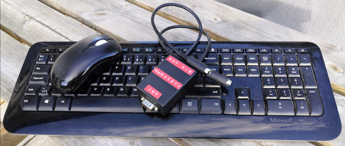
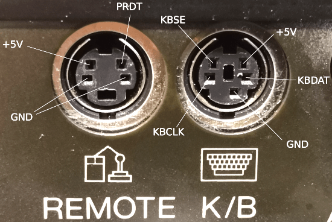

# mwd2cdtv
Microsoft wireless desktop keyboard mouse adapter for Amiga CDTV

What is this?
-------------
In short, it's an Arduino based translator for an older wireless keyboard
and mouse combo (Microsoft Wireless Desktop 800), so that you can use them
with a Commodore CDTV. It uses an Arduino and an NRF24L01+ module.

Status
------
It works. In particular, mouse works really well since I reversed engineered
the CD-1253 (original CDTV mouse) protocol (couldn't find it elsewhere on the net).
Keyboard works, but The might be keymappings that could be improved.
Also, key-rollover/fast typing is janky, might be improvable by buffering keyboard events.
Joystick works.

I want to do this!
------------------
First off you'd need an old wireless keyboard/mouse. I've used Microsoft Wireless Desktop 800
'cause that's what I had. Other might work or might be made to work.
Newer keyboards are properly encrypted and hence won't work.
You'd need to sniff the keyboard and mouse addresses. Using something like
[uC mousejack](https://github.com/insecurityofthings/uC_mousejack) or
[keysweeper](https://github.com/samyk/keysweeper)
and insert your specific addresses (and channels) into the sketch. 

 |Arduino pin|AVR Pin|Description|
 |-----------|-------|-----------| 
 |  3  |  (PD3, INT1)  |   KB_DATA  |
 |  4  |  (PD4)        |   KB_CLK |
 |  5  |  (PD5)        |   nRF24L01 CE |
 |  6  |  (PD6)        |   nRF24L01 CSN |
 |  11 |  (PB3, MOSI)  |   nRF24L01 MOSI |
 |  12 |  (PB4, MISO)  |   nRF24L01 MISO |
 |  13 |  (PB5, SCK)   |   nRF24L01 SCK |
 |  7  |  (PD7)        |   CDTV PRDT |
 |  A0 |  (PC0)        |   JOYSTICK UP |
 |  A1 |  (PC1)        |   JOYSTICK DOWN |
 |  A2 |  (PC2)        |   JOYSTICK LEFT |
 |  A3 |  (PC3)        |   JOYSTICK RIGHT |
 |  A4 |  (PC4)        |   JOYSTICK BUTTON B |
 |  A5 |  (PC5)        |   JOYSTICK BUTTON A |
 

